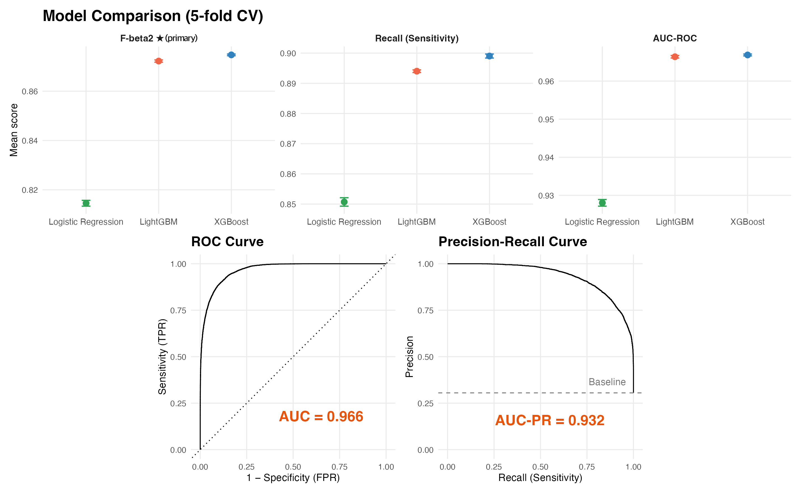

# EV Charging Network Customer Churn Prediction

> Predicting EV charging network customer churn using XGBoost, SHAP interpretation, and cost-aware model selection (F-beta2).

Machine learning project analysing churn behaviour for a fictional New Zealand EV charging network (**KoruCharge**), developed as a portfolio project extending an earlier university case study.

---

## Objective

Identify customers most likely to churn and translate model outputs into **actionable operational retention strategies**, rather than focusing purely on predictive accuracy.

---

## Key Results

| Metric | Value |
|---|---|
| Best model | XGBoost |
| F-beta2 (primary) | 0.870 |
| Recall | 0.894 |
| AUC-ROC | 0.966 |
| AUC-PR | 0.932 |

Key churn drivers identified by the model include:

- **Charging inactivity** (`weeks_since_last_charge`) - strongest predictor by a large margin  
- **Low satisfaction scores** and survey non-response  
- **Recent payment failures** in the past 4 weeks  
- **Compounded service friction** (high wait times combined with charger faults)

---

## Model Performance

The figure below summarises model comparison results from cross-validation alongside the final model's ROC and Precision–Recall curves.



---

## What This Project Does

| Area | Detail |
|---|---|
| Feature set | Full synthetic customer dataset (24 variables) + 3 engineered features |
| Engineered features | `fault_wait_index`, `crash_per_session`, `recency_bucket` |
| Models compared | Logistic Regression, XGBoost, LightGBM |
| Selection criterion | F-beta (β = 2) - recall-weighted, cost-aware |
| Interpretability | Variable importance + SHAP values + Logistic Regression odds ratios |
| Evaluation | ROC curve + Precision–Recall curve (more informative under class imbalance) |

---

## Why F-beta (β = 2) Instead of AUC?

Missing a churning customer (lost lifetime value) is more costly than unnecessarily contacting a retained one (small intervention cost).

F-beta with **β = 2** therefore weights **Recall twice as heavily as Precision**, aligning model selection with the operational objective of identifying high-risk customers for intervention.

AUC remains useful for comparing model discrimination, but it is **threshold-independent** and therefore less directly tied to the intervention decision.

---

## Recommended Actions

- **Re-engagement automation** - trigger outreach after 6 weeks of inactivity, before customers become fully inactive  
- **Billing rescue workflows** - automatically respond to payment failures within 24 hours  
- **Service recovery prioritisation** - prioritise maintenance at stations where long waits and charger faults occur together  

---

## Data

The original dataset (`korucharge_customers.csv`) is **not included** in this repository due to GitHub file size limits.

Instead, the repository provides:

- `data/korucharge_customers_metadata.csv` - variable descriptions and feature definitions used in the analysis

The dataset used in this project is **synthetic** and created for academic purposes.

---

## Repository Structure

```
korucharge-churn/
├── korucharge_churn_analysis.qmd
├── korucharge_churn_analysis.html
├── README.md
│
├── data
│   └── korucharge_customers_metadata.csv
│
└── images
    └── churn_model_performance.png
```

---

## Tools & Techniques

- **Language:** R  
- **ML framework:** tidymodels (recipes, workflows, resampling)  
- **Models:** Logistic Regression, XGBoost, LightGBM  
- **Interpretability:** SHAP values (SHAPforxgboost), variable importance (vip), odds ratios  
- **Feature engineering:** interaction terms, ratio features, ordinal bucketing  
- **Validation:** stratified 5-fold cross-validation, Precision–Recall analysis  
- **Visualisation:** ggplot2, ggridges, patchwork  
- **Reporting:** Quarto (HTML report)

---

## Full Analysis

View the full interactive report:

👉 https://shindatax.github.io/korucharge-churn/korucharge_churn_analysis.html

---

## How to Run

```r
# Install required packages (first run only)
# Set INSTALL_PACKAGES <- TRUE in the setup chunk

# Place korucharge_customers.csv in your working directory

# Render the report
quarto::quarto_render("korucharge_churn_analysis.qmd")
```

---

## About

Portfolio project based on a **BUSINFO 704 (Predictive Business Analytics)** case study at the **University of Auckland**.

All data used in this project is synthetic.

**Shinyeong Kim**
